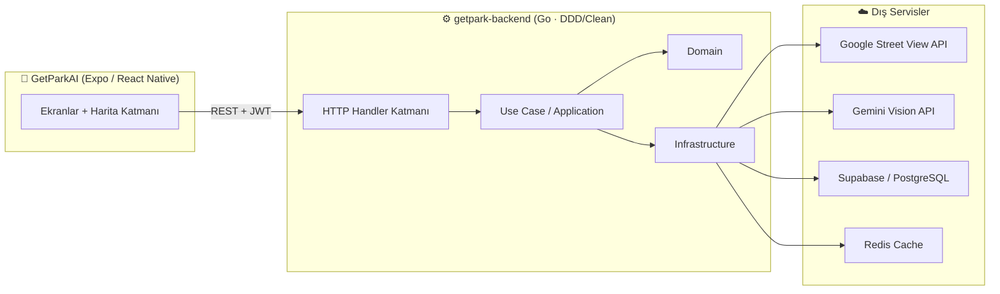

<div align="center">

# 🅿️ GetPark AI

### Yapay Zekâ Destekli Kentsel Otopark & Park Uygunluk Analiz Platformu

*Şehirleri daha akıllı park eden bir geleceğe taşıyoruz.*

<br/>

[](https://expo.dev/)
[](https://go.dev/)
[](https://ai.google.dev/)
[](https://supabase.com/)
[](#-kvkk--gizlilik)
[](#-lisans)

</div>

---

## 📑 İçindekiler

- [Proje Hakkında](#-proje-hakkında)
- [Öne Çıkan Özellikler](#-öne-çıkan-özellikler)
- [Ekranlar](#-ekranlar)
- [Mimari](#-mimari)
- [Teknoloji Yığını](#-teknoloji-yığını)
- [Kurulum](#-kurulum)
  - [Mobil Uygulama](#1-mobil-uygulama-getparkai)
  - [Backend](#2-backend-getpark-backend)
- [API Uç Noktaları](#-api-uç-noktaları)
- [KVKK & Gizlilik](#-kvkk--gizlilik)
- [Kentsel Park İndeksi](#-kentsel-park-i̇ndeksi)
- [Proje Yapısı](#-proje-yapısı)
- [Yol Haritası](#-yol-haritası)
- [Ekip & Lisans](#-lisans)

---

## 🎯 Proje Hakkında

**GetPark AI**, sokak görüntülerini yapay zekâ ile analiz ederek bir bölgenin **park uygunluğunu**, **kaldırım ihlali riskini** ve **trafik akışına etkisini** ölçen uçtan uca bir platformdur.

Belediyeler, kent planlamacıları ve denetim ekipleri için tasarlanan platform; Google Street View görüntülerini **Gemini Vision** modeliyle işler, araçları tespit eder, kişisel verileri **KVKK uyumlu** şekilde anonimleştirir ve sonuçları anlaşılır bir **Kentsel Park İndeksi** skoruna dönüştürür.

> 📄 Tasarım ve sunum dosyası: [`docs/GetPark_Cursor.pdf`](docs/GetPark_Cursor.pdf)

---

## ✨ Öne Çıkan Özellikler

| | Özellik | Açıklama |
|---|---|---|
| 🤖 | **AI Görüntü Analizi** | Gemini 2.5 Flash ile araç tespiti, sınıflandırma ve park düzeni değerlendirmesi |
| 🛰️ | **Street View Entegrasyonu** | Koordinattan otomatik sokak görüntüsü çekme ve analiz |
| 🗺️ | **Canlı Haritalar** | Tüm ekranlarda `react-native-maps` ile gerçek harita ve risk işaretçileri |
| 🛡️ | **KVKK Uyumlu Anonimleştirme** | Plaka ve kişisel veri bulanıklaştırma, ham görsellerin kalıcı saklanmaması |
| 📊 | **Kentsel Park İndeksi** | Park uygunluğu, trafik etkisi ve kentsel riski tek skorda birleştiren özel formül |
| 📈 | **Raporlama** | PDF/CSV rapor oluşturma, trend grafikleri ve paylaşılabilir bağlantılar |
| ⚡ | **Hızlı Demo Modu** | Saha verisi olmadan akıcı, baştan sona çalışan demo deneyimi |
| 🏛️ | **Kurumsal Mimari** | `masterfabric-go` tabanlı DDD / Clean Architecture backend |

---

## 📱 Ekranlar

| Ekran | Açıklama |
|---|---|
| **Ana Sayfa** | Genel uygunluk skoru, canlı mini harita ve hızlı erişim |
| **Risk Haritası** | İlçe bazlı renkli risk işaretçileri (kırmızı / turuncu / yeşil) |
| **Street View** | Konum üzerinden sokak görüntüsü ve analiz başlatma |
| **Analiz Başlat** | Konum seçimi, anonimleştirme ayarları ve model seçimi |
| **Analiz Akışı** | Otomatik ilerleyen, adım adım canlı analiz görünümü |
| **Sonuç** | Park uygunluk skoru, bulgular ve önerilen aksiyonlar |
| **Detay İncelemesi** | Araç kümeleri, riskli ve anonimleştirilen bölgeler |
| **Geçmiş** | Önceki analizlerin filtrelenebilir listesi |
| **Raporlar** | Rapor yapılandırma, önizleme ve dışa aktarma |
| **KVKK** | Veri işleme ve gizlilik politikası |

---

## 🏗️ Mimari



**Akış:** Konum → Street View görüntüsü → KVKK anonimleştirme → Gemini analizi → Skor hesaplama → Supabase'e kayıt → Mobil görselleştirme.

---

## 🧰 Teknoloji Yığını

**Mobil**
- Expo + React Native (TypeScript)
- Expo Router (dosya tabanlı navigasyon)
- react-native-maps (Google / Apple Maps)
- Custom tasarım sistemi (`constants/Colors.ts`)

**Backend**
- Go 1.22 · `masterfabric-go` (DDD / Clean Architecture)
- Gemini 2.5 Flash (Vision)
- Google Street View Static API
- Supabase (PostgreSQL) + Redis cache
- JWT tabanlı kimlik doğrulama

---

## 🚀 Kurulum

### Ön Gereksinimler
- Node.js 18+ ve npm
- Go 1.22+
- Bir Supabase (PostgreSQL) bağlantısı
- Google Maps / Street View ve Gemini API anahtarları

### 1) Mobil Uygulama (`GetParkAI`)

```bash
cd GetParkAI
npm install

# Geliştirme sunucusu
npx expo start

# iOS (fiziksel cihaz / simülatör)
npx expo run:ios
```

`app.json` içindeki `ios.config.googleMapsApiKey` ve `android.config.googleMaps.apiKey` alanlarına kendi Google Maps anahtarlarınızı girin.

### 2) Backend (`getpark-backend`)

```bash
cd getpark-backend

# Ortam değişkenlerini ayarlayın
cp .env.example .env   # yoksa .env oluşturup aşağıdaki değerleri girin

go mod download
go run ./cmd/server
```

`.env` örneği:

```env
GEMINI_API_KEY=...
GEMINI_MODEL=gemini-2.5-flash
STREETVIEW_API_KEY=...
GOOGLE_MAPS_API_KEY=...
DATABASE_URL=postgresql://<user>:<pass>@<host>:6543/postgres
```

> Sunucu varsayılan olarak `http://localhost:8080` üzerinde çalışır.

---

## 🔌 API Uç Noktaları

| Metot | Yol | Açıklama |
|---|---|---|
| `POST` | `/api/v1/parking/analyze` | Yüklenen fotoğrafı analiz eder |
| `GET`  | `/api/v1/parking/streetview?lat=&lng=` | Koordinattan Street View çekip analiz eder |
| `GET`  | `/api/v1/parking/map?lat=&lng=&radius=` | Bölgedeki park noktalarını döndürür |
| `POST` | `/api/v1/auth/register` | Kullanıcı kaydı |
| `POST` | `/api/v1/auth/login` | Giriş ve JWT alma |

Örnek:

```bash
curl "http://localhost:8080/api/v1/parking/map?lat=40.99&lng=29.03&radius=500" \
  -H "Authorization: Bearer <JWT>"
```

---

## 🛡️ KVKK & Gizlilik

GetPark AI, kişisel verilerin korunmasını tasarımın merkezine alır:

- ✅ **Otomatik Anonimleştirme** — Plakalar ve kişiyi tanımlayan veriler bulanıklaştırılır.
- ✅ **Ham Görseller Saklanmaz** — Görüntüler yalnızca geçici olarak işlenir, kalıcı kaydedilmez.
- ✅ **Güvenli Veri İşleme** — Tüm analizler KVKK kapsamında, şifreli şekilde gerçekleştirilir.
- ✅ **Şeffaflık** — Kullanıcı, uygulama içinden KVKK politikasına her an erişebilir.

---

## 📐 Kentsel Park İndeksi

Her bölge için 0–100 arası tek bir skor üretilir:

```
Skor = w₁ · ParkUygunluğu + w₂ · (100 − TrafikEtkisi) + w₃ · (100 − KentselRisk)
```

| Aralık | Seviye | Anlam |
|---|---|---|
| 80–100 | 🟢 Yüksek | Park düzeni uygun, risk düşük |
| 60–79  | 🟡 Orta | İyileştirme alanları mevcut |
| 0–59   | 🔴 Düşük | Yüksek risk, denetim gerekli |

---

## 🗂️ Proje Yapısı

```
Cursor/
├── GetParkAI/                 # 📱 Expo / React Native mobil uygulama
│   ├── app/                   #   Ekranlar (Expo Router)
│   │   ├── (tabs)/            #   Sekmeler: ana sayfa, analiz, geçmiş, raporlar
│   │   └── analysis/          #   Analiz akışı: start, running, result, detail
│   ├── components/            #   Paylaşılan bileşenler (AppHeader, ScoreCircle...)
│   └── constants/             #   Tasarım sistemi (renkler, ölçüler)
│
├── getpark-backend/          # ⚙️ Go backend (masterfabric-go mimarisi)
│   ├── cmd/server/            #   Uygulama giriş noktası
│   ├── internal/
│   │   ├── application/        #   Use case'ler
│   │   ├── domain/            #   Alan modelleri
│   │   ├── infrastructure/     #   HTTP, Postgres, Gemini, Street View
│   │   └── shared/           #   Config, logger, middleware...
│   └── migrations/           #   Veritabanı şemaları
│
├── docs/
│   └── GetPark_Cursor.pdf     # 📄 Sunum & tasarım dosyası
└── README.md
```

---

## 🗺️ Yol Haritası

- [x] Mobil uygulama ekranları ve gerçek harita entegrasyonu
- [x] KVKK uyumlu anonimleştirme
- [x] Gemini Vision ile park analizi
- [x] Supabase entegrasyonu ve REST API
- [ ] Gerçek zamanlı toplu (batch) bölge taraması
- [ ] Belediye yönetim paneli (web)
- [ ] Çoklu şehir desteği ve karşılaştırmalı analiz

---

## 📜 Lisans

Bu proje **MIT Lisansı** ile lisanslanmıştır.

<div align="center">

---

**GetPark AI** ile geliştirildi · Bir hackathon projesi 🚀

*Daha akıllı, daha düzenli ve daha yaşanabilir şehirler için.*

</div>
